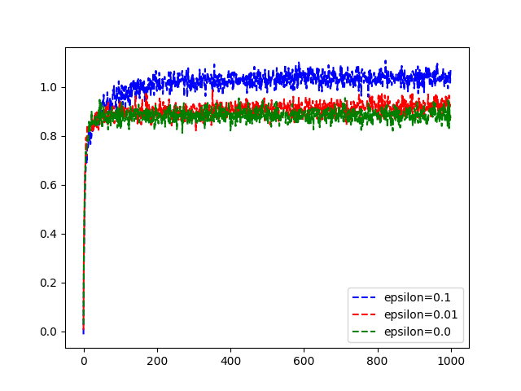

#Problem summary
- There is a set of N random actions
- Each action has its own distribution
- The goal here is to estimate this distribution and get the best choice over time
- When having minimum resources we are left with the problem of exploration vs exploitation
- in which we conquer in this problem by using an epsilon value as a threshold for randomly exploring over exploiting the reward

###TODO
- [ ] implement the **UCB1** approach 
- [ ] Apply real world application as an example to this problem

# Algorithm performance
