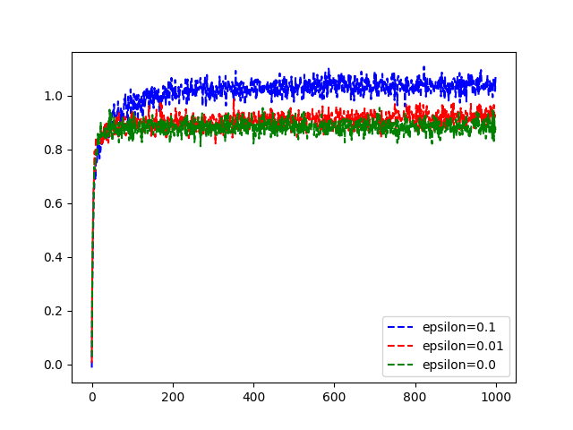

# Problem summary
- There is a set of N random actions
- Each action has its own distribution
- The goal here is to estimate this distribution and get the best choice over time
- When having minimum resources we are left with the problem of exploration vs exploitation
- in which we conquer in this problem by using an epsilon value as a threshold for randomly exploring over exploiting the reward

### TODO
- [x] implement the **UCB1** approach 
  - Having an optimistic initialization of the reward Q encourages the agent to explore more and more
  as it faces disappointment instead of encouragement with each reward. upper confidence bound action selection
  takes advantage of this and also take into account long term reward by looking into the variance of the distribution
  - Higher variance -> Higher potential for reward
  - A = argmax(Q(a) + c*sqrt(ln(t)/Nt(a)))
  - ln(t)  natural log of t steps
  - number of times an actions is performed prior to t
  - C control degree of exploration -> Hyper-parameter c>0
- [ ] Apply real world application as an example to this problem
- [ ] Change formulas to latex

# Algorithm performance

## Side notes
- **constant al**pha is better for non-stationary distributions**
- Downside for optimistic initialization is that the algorithm doesn't take into account long term reward instead of short term
- UCB1 notes : 
  - when selecting an action -> uncertainty decreases
  - on selecting something else -> uncertainty increases
  - The algorithm should take into account if Nt(a) = 0 which means `a` the action estimate is a maximum
  - All actions will be selected
  - No epsilon greedy